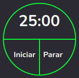

<h1 align='center'> Temporizador React ⏲</h1>

    
    

## Temporizar simples feito com <a href="https://pt-br.reactjs.org/">🔗 React</a>.

<h1 align="center">
    
</h1>

### 🛠️ Ferramentas && tecnologias usadas:

- <a href='https://vitejs.dev/'>ViteJS</a>
